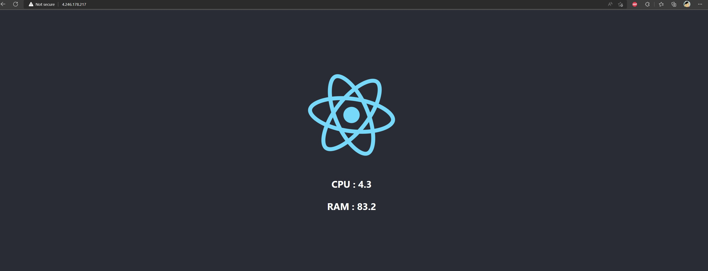
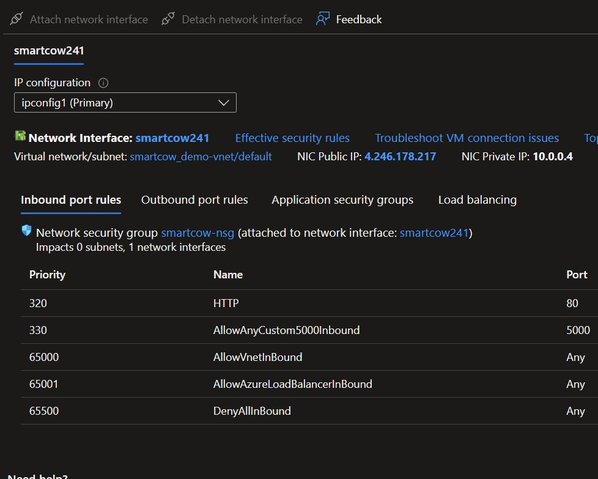

# SysStats

This a simple Python - Flask Web App, which reads the current RAM and CPU usage and a React frontend which shows the statistics in the browser.

I used a Python based web server (Gunicorn), and a proxy web server (nginx) in front of the Python API.

There are three docker containers that are in use, API,Client and other for the proxy.

Docker container that runs the API part of the project, which is stored in the api subdirectory.
It uses Python 3.10 image as base.

The second Docker container that serves the React front end to clients.
It uses Node.js 16 image as base, which comes pre-installed with node and yarn.

The third Docker container that runs an nginx server proxies requests for the API to the container.
It uses Nginx latest image as base.

`Steps for deployment`
- Create a vm with public ip address on azure.
- Enable outbound port 80 for outside world access to application frontend.
- SSH to the vm and clone the repo.
- Spin up the containers using the below command `docker-compose up --build`.
- Go the url `http://4.246.178.217/` where the application deployed.
- Verfy the appication front end is accesible via internet.
- Restrict access to SSH via only personal ip address.

`Demo of the application`

`Azure vm settings`

